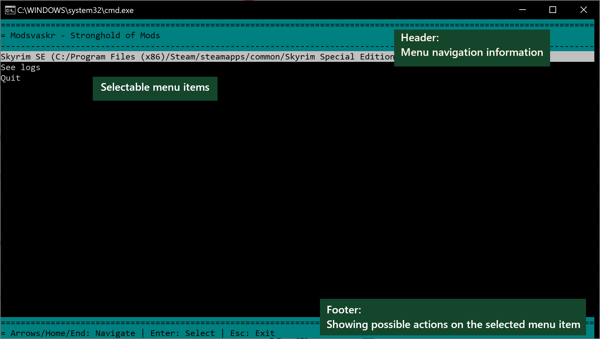
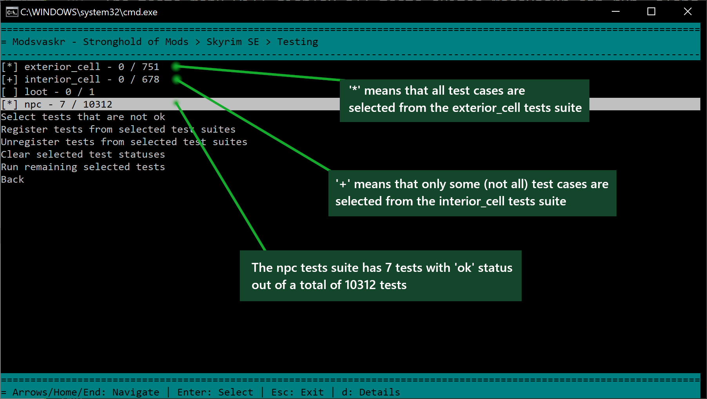
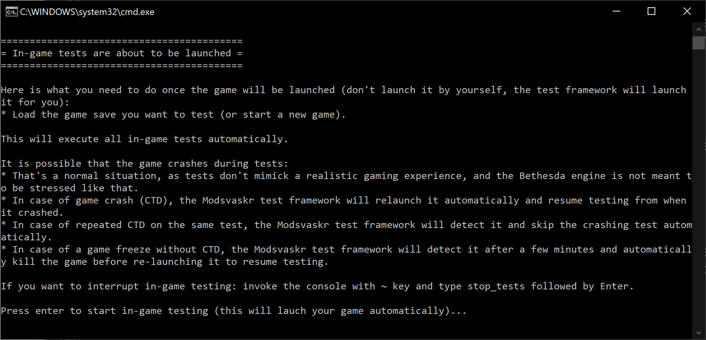
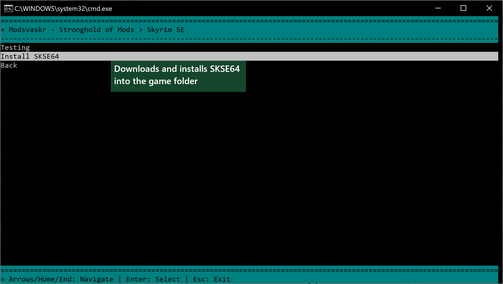
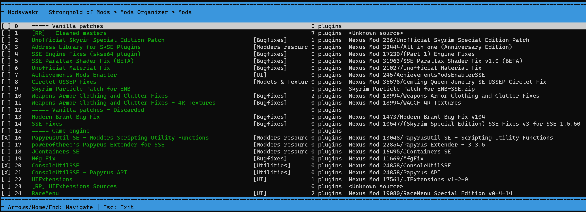
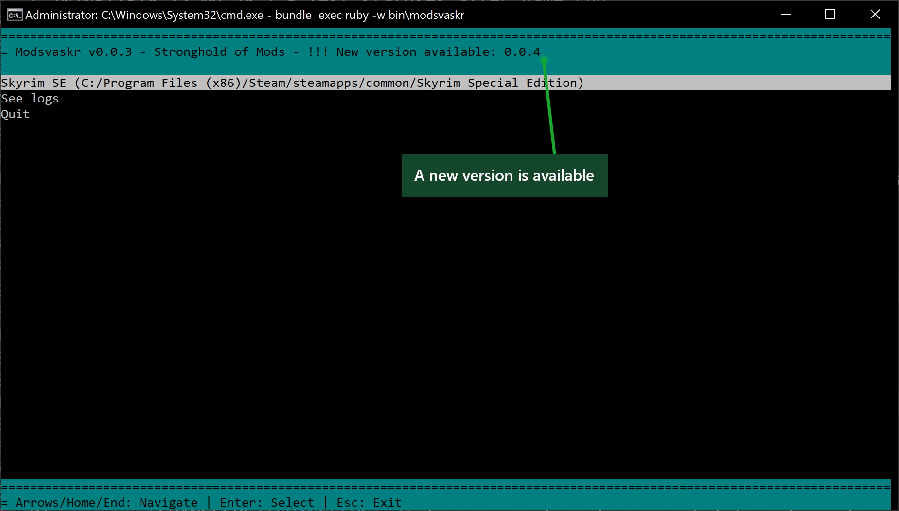

[](https://github.com/semantic-release/semantic-release)

# Stronghold for mods acting like companions: The Modsvaskr

Command-line UI handling a full Mods' ecosystem for Bethesda's games.

## Description

Heavy mods' user often have **hard times when they want to get a stable modded game**.
A lot of tools are already helping a lot:
* [Mod Organizer](https://www.nexusmods.com/skyrimspecialedition/mods/6194)
* [LOOT](https://loot.github.io/)
* [xEdit](http://tes5edit.github.io/)
* Plenty of tools to create patches, merge, generate content like LODs etc...

Most of the time, gamers have to perform the following tasks every time their mods list changes:
* **Read carefully** all the descriptions of each mod they use.
* **Re-install mods having patches** for newly added mods (using FOMOD installers for the easiest, and search/install patches from NexusMods for others).
* **Correct all errors and warnings** reported by tools like LOOT (change mods list upon incompatibilities, clean esps from dirty records...).
* **ESLify some esps** if they need to get below the 254 esps limit of the new mods.
* **Merge esps** if eslification is not enough to keep below the limit.
* **Manually patch some mods** using tools like xEdit or the Creation Kit, or sometimes files renaming.
* **Re-generate all generated content**, like LODs, FNIS animations, Patches...
* And **test, test, test** - usually breaking the immersive experience of discovering added content naturally in game: to test new mods they usually have to visit changed locations, fly around in high-speed, summon NPCs to check for black faces, etc...

Given those tedious tasks, gamers have basically few choices:
* Rely only on mods lists already tested and curated by other modders (like the excellent [S.T.E.P. guide](https://wiki.step-project.com/Main_Page)), or
* Keep the mods number relatively small, and remove mods before adding new ones (therefore having to start games from scratch), or
* Learn skills of an experienced modder to be able to solve the previous points easily (takes a loooot of time, comprehension and curiosity), or
* Accept to have a game that is not stable, ruining the gaming experience, or
* Ask Modsvaskr for help ;-)

Modsvaskr is here to help gamers do the following:
* **Automate repeatible and tedious tasks** they have to do while updating their mods list (patchs, LODs...).
* **Automate lot of testing** so that they can detect quickly without manually tests, and without having to discover mods before-hand and ruin their in-game experience (automatically load changed locations, new NPCs...).
* **Detect issues early**, so that they can focus of solving the most important issues in their mods list.
* Simplify the way non-modder gamers can **improve and automate their gaming experience**.

The goal as a gamer using Modsvaskr is to be able to:
* **Easily update a mods list** without fear or forgetting some processing, for a large number of mods (over 1000).
* Know quickly and without human intervention **what could go wrong** in using all those mods.
* Solve problems that could be **solved automatically**.
* **Not spoil the mods' content** while testing for in-game stability.

## Games

The list of games that should be compatible with Modsvaskr are the following:
* Skyrim.
* Skyrim Special Edition - Tested successfully.
* Fallout 4.

The list of supported games in the current version of Modsvaskr is found in the [`lib/modsvaskr/games`](lib/modsvaskr/games) folder.
Adding a new compatible game should be as easy as adding a file in this directory and implementing its API in Ruby.

## Requirements

3 tools and 2 mods are needed for Modsvaskr to work:
* [Ruby 2.6.6 with DevKit](https://rubyinstaller.org/downloads/) as this is the language Modsvaskr is written in - Don't install a version greater or equal to 2.7 for the time being as some dependencies don't work well on Windows in those versions.
* [SKSE](https://skse.silverlock.org/) to support a lot of scripting. - You have to install this on your Bethesda game.
* [xEdit](https://www.nexusmods.com/skyrimspecialedition/mods/164) to get information from mods. - You have to install this in a common programs directory (like Program Files), and not in your game folder.
* [AutoLoad](https://www.nexusmods.com/skyrimspecialedition/mods/41478) to be able to automatically restart the game after a CTD. - Install this like any other mod.
* [AutoTest](https://www.nexusmods.com/skyrimspecialedition/mods/42520) to be able to automatically run in-game testing. - Install this like any other mod.

## Install

Via gem

``` bash
$ gem install modsvaskr
```

Using `bundler`, add this in your `Gemfile`:

``` ruby
gem 'modsvaskr'
```

Modsvaskr needs a configuration file to be created in the current directory from which it is executed, named `modsvaskr.yaml`.
Check the [`modsvaskr.yaml.sample`](modsvaskr.yaml.sample) file to know how to create it.

## Usage

Running Modsvaskr is done this way:

``` bash
modsvaskr
```

Modsvaskr is a simple command-line UI organized as hierarchical menus, in which you navigate with the arrow keys, page up/down, `Home`, `End`, `Esc`, and select/enter elements using mostly the `Enter` key. Specific items may have different actions linked to other keys, documented at the bottom of the UI.



The following sections describe a bit more each main use-case you have with Modsvaskr.

### Running automated tests in your game

Modsvaskr can automate a lot of testing in your modded game.
For this you go into your game's menu, and select `Testing`.

The tests menu will display all tests suites Modsvaskr can run, along with the number of tests passed over the total number of tests registered.
At first no test is registered, so you'll get `0 / 0` tests passed over total.

You first need to discover the possible tests to be run for each tests suite. To do so:
* Select the test suites for which you want to discover tests (by hitting Enter on each test suite).
* Select the item `Register tests from selected test suites`. This step will discover all the test cases for the selected suites. Some test suites will require xEdit for this: it will run xEdit automatically (if xEdit prompts you with the list of plugins, keep the default by just hitting OK).

Once tests have been registered, you can select which tests you want to run, by selecting (`Enter`) each tests suite to be run. Hitting `d` on a tests suite will give you details about all the test cases registered for this tests suite, and allow you to select those test cases individually.



Once tests have been selected among the tests suites, you can run those tests by selecting `Run remaining selected tests`.
Running tests can require to execute those tests in-game. In such a case, Modsvaskr will use the [AutoTest](https://www.nexusmods.com/skyrimspecialedition/mods/42520) and [AutoLoad](https://www.nexusmods.com/skyrimspecialedition/mods/41478) mods to automatically run tests in your game, and will tell you about it before executing the tests.



Please note that Modsvaskr will not run tests that have already passed successfully. That allows you to interrupt testing anytime and re-run it later without having to change the tests selection.

Once tests have been run, you can check the tests statuses by looking at the counters next to each tests suite in the tests menu, and by looking at individual test case statuses in each tests suite's menu (using the `d` key).

**In case your game keeps executing tests automatically at game launch and you want it to stop** you can just remove the file `SKSE/Plugins/StorageUtilData/AutoTest_Config.json` from your game's data folder. It will be re-created the next time you ask for tests to be run automatically.

#### Tests suites

Here are the different tests suites covered by Modsvaskr.
Test suites are defined as plugins following the pattern `lib/modsvaskr/tests_suites/*.rb`. It's simple to add new ones, just by adding new files in this directory.

##### Exterior cell

This suite is using in-game testing.

This suite tests exterior cells by issuing a Center-On-World console command (`cow`) on a given exterior cell coordinates and performs a short camera rotation to ensure the cell is loaded properly.

This suite registers tests by getting xEdit information about which vanilla cells are being modified by mods. It won't register tests for cells that are not modified, nor cells that are not vanilla. It will also optimize the choosen cells to test by using the 5x5 grid load of each cell: any cell that is in the 5x5 grid vicinity of another tested cell will not be tested, as in-game testing will anyway have loaded it.

##### Interior cell

This suite is using in-game testing.

This suite tests interior cells by issuing a Center-On-Cell console command (`coc`) on a given exterior cell coordinates and performs a short camera rotation to ensure the cell is loaded properly.

This suite registers tests by getting xEdit information about which vanilla cells are being modified by mods. It won't register tests for cells that are not modified, nor cells that are not vanilla.

##### NPC

This suite is using in-game testing.

This suite tests NPCs by teleporting both the Player and the NPC to a photo-shoot location in a test cell, and taking a screenshot of the NPC to be tested, without any inventory.

This suite registers tests by getting xEdit information about which NPCs are being defined by mods. It will register 1 test per NPC having a full name, whatever the mod defining it.

##### NPC Head

This suite is using in-game testing.

This suite tests NPCs by teleporting both the Player and the NPC to a photo-shoot location in a test cell, and taking a screenshot of the head-part of the NPC to be tested, without any inventory. Useful to check for neck seams or gaps.

This suite registers tests by getting xEdit information about which NPCs are being defined by mods. It will register 1 test per NPC having a full name, whatever the mod defining it.

#### Troubleshooting tests execution

Tests execution logs useful information in Modsvaskr logs, which can you read:
* either through the main Modsvaskr's menu (selecting `See logs`)
* or in Modsvaskr's log file directly (in `Modsvaskr.log`)

Modsvaskr creates JSON files **in your game's Data folder** to track its registered tests statuses, following the pattern `Modsvaskr/Tests/Statuses_*.json`. In here you'll find all tests statuses.

Example from `Modsvaskr/Tests/Statuses_interior_cell.json`
```json
[
  [
    "AAADeleteWhenDoneTestJeremy",
    "ok"
  ],
  [
    "AbandonedPrison01",
    "ok"
  ],
  [
    "AbandonedShackInterior",
    ""
  ]
]
```

### Installing SKSE easily in your game

When selecting your game, you can ask Modsvaskr to easily install SKSE in it. This is useful when SKSE gets upgraded.
By selecting the `Install SKSE64` item in the game menu, Modsvaskr will download and install the latest SKSE version in your game folder.

If you run this feature under Mod Organizer, don't forget to save the modified files from the Overwrite mode in a dedicated ModOrganizer mod to not lose them.



### Using Modsvaskr with ModOrganizer

Modsvaskr has a menu dedicated to ModOrganizer, where you can see the various mods and plugins configured in Modsvaskr.



## Troubleshooting

Logs of execution of Modsvaskr are stored in the current folder: `Modsvaskr.log`.
Here is an example of execution logs:

```
[ 2020-11-18 13:02:42 ] - Launch Modsvaskr UI v0.0.1 - Logs in C:/Programs/Modsvaskr/Modsvaskr.log
[ 2020-11-18 13:04:41 ] - Launch Game (#0) using configured launcher...
[ 2020-11-18 13:04:51 ] - SkyrimSE.exe has started with PID 13344
[ 2020-11-18 13:04:51 ] - Start monitoring game testing...
[ 2020-11-18 13:06:42 ] - ===== Test statuses changes:
[ 2020-11-18 13:06:42 ] - * NPCs:
[ 2020-11-18 13:06:42 ] -   * skyrim.esm/7: ok
[ 2020-11-18 13:06:47 ] - ===== Test statuses changes:
[ 2020-11-18 13:06:47 ] - * NPCs:
[ 2020-11-18 13:06:47 ] -   * skyrim.esm/78421: ok
[ 2020-11-18 13:06:47 ] -   * skyrim.esm/78428: ok
[ 2020-11-18 13:06:52 ] - ===== Test statuses changes:
[ 2020-11-18 13:06:52 ] - * NPCs:
[ 2020-11-18 13:06:52 ] -   * skyrim.esm/78431: ok
[ 2020-11-18 13:06:52 ] -   * skyrim.esm/78432: ok
[ 2020-11-18 13:06:58 ] - End monitoring game testing.
[ 2020-11-18 13:06:58 ] - Test statuses after game run:
[ 2020-11-18 13:06:58 ] - [ NPCs ] - 5 / 5 - Next test to perform: None
```

They are also accessible through Modsvaskr's UI, in the `See logs` menu item.

## Update

When a new version is available, Modsvaskr will mention it in the header of the main menu:


Updating Modsvaskr to the latest version is done the standard way for any Rubygem:
``` bash
gem update modsvaskr
```

Or if you are using Bundler:
``` bash
bundle update modsvaskr
```

## Change log

Please see [CHANGELOG](CHANGELOG.md) for more information on what has changed recently.

## Contributing

Any contribution is welcome:
* Fork the github project and create pull requests.
* Report bugs by creating tickets.
* Suggest improvements and new features by creating tickets.

## Credits

- [Muriel Salvan][link-author]

## License

The BSD License. Please see [License File](LICENSE.md) for more information.
